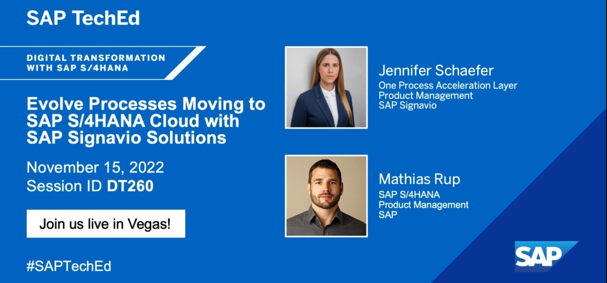

# DT260 - Evolve Processes Moving to SAP S/4HANA Cloud with SAP Signavio Solutions

 

Take a deep dive into the internal processes supported by SAP S/4HANA using SAP Signavio Process Transformation Suite. Start at the surface level by leveraging the new SAP Signavio Process Explorer solution. Learn about innovations and next-generation process improvements. Then get your hands dirty with process mining to optimize your intelligent ERP system, derive insights, measure KPIs, and learn where you deviate from best practices. 

## Exercises

- [Exercise 1 - Explore best practices processes of SAP S/4HANA Cloud](exercises/ex1/)
- [Exercise 2 - Analyze and investigate process mining results](exercises/ex2/)
- [Exercise 3 - Adapt the process data model](exercises/ex3/)
- [Exercise 4 - Investigate and improve your process](exercises/ex4/)
- [Bonus Exercises - Optional](exercises/bonus/)

## How to obtain support

Support for the content in this repository is available during the actual time of the online session for which this content has been designed. Otherwise, you may request support via the [Issues](../../issues) tab.

**[📄 Documentation Signavio Process Intelligence](https://documentation.signavio.com/suite/en-us/Content/process-intelligence.htm)**

## License
Copyright (c) 2022 SAP SE or an SAP affiliate company. All rights reserved. This project is licensed under the Apache Software License, version 2.0 except as noted otherwise in the [LICENSE](LICENSES/Apache-2.0.txt) file.
