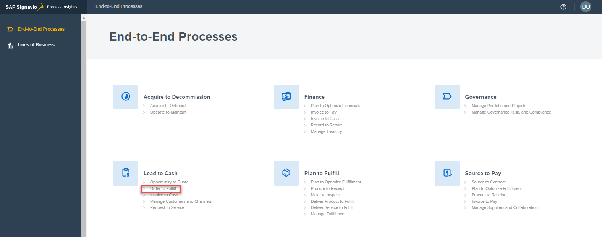
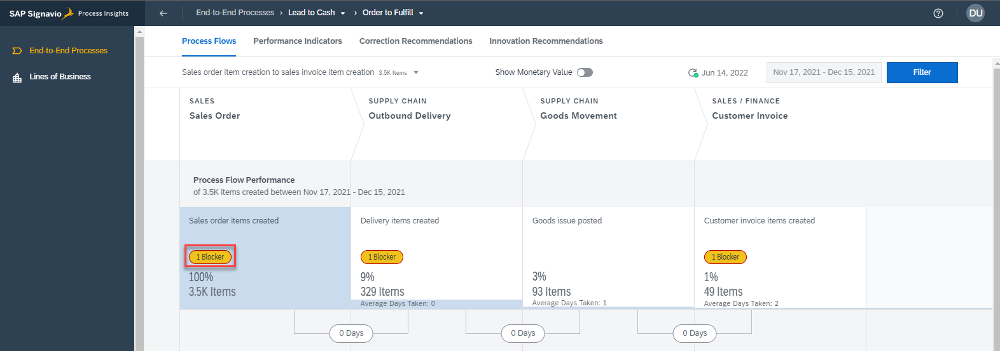
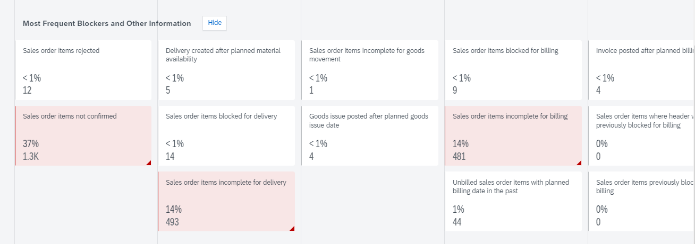
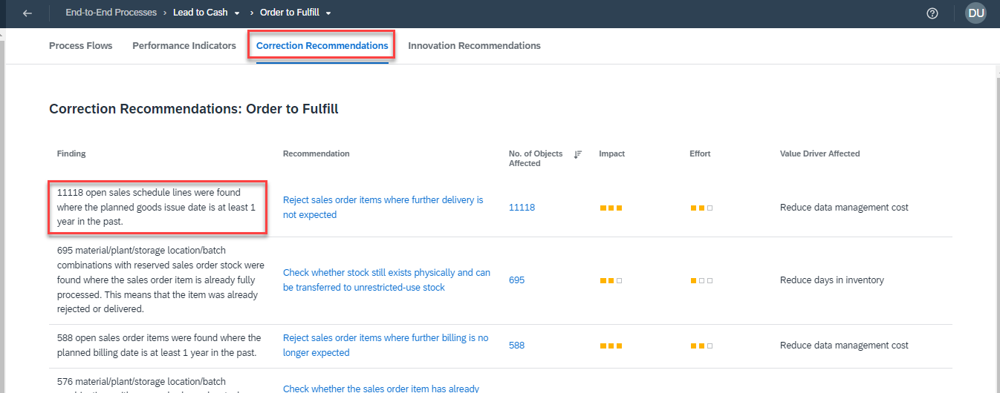
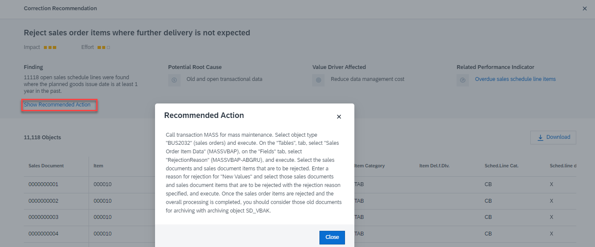
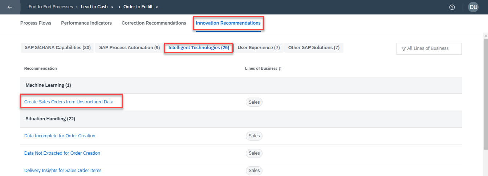

# Bonus Exercises

This chapter contains a couple of ideas to further explore SAP Signavio &amp; SAP S/4HANA Cloud

## Exercise 5.1 Jump into the SAP S/4HANA Cloud system
You can access the connected SAP S/4HANA Cloud system here: https://my401669.s4hana.cloud.sap/ui.
  Open app `Track Sales Orders` to find a specific Sales Order to analyze
 
In SAP Signavio Process Intelligence create a new Investigation chapter and filter to compare that same Sales Order
 
Add a SiGNAL table widget to show all context data collected in the Process Log

## Exercise 5.2 Dashboards
In SAP Signavio Process Intelligence, you'll find `Dashboards` (next to Investigations). 
 

With a dashboard, you can do in-depth process mining analysis and tell your story using data visualizations. It also lets you monitor key performance indicators that are relevant to a specific goal. You can create many dashboards for each business process, for example, one dashboard for each audience.

On a dashboard, you can also do the following:
* visualize data in widgets, grouping different aspects of complex processes on separate pages
* narrow down data with filters

The layout of a dashboard is flexible. You can resize and rearrange widgets based on your preference.

Multiple users can work simultaneously on a dashboard without overriding each other’s work. So, you can make changes that don't need to be saved, for example, when you change filters for exploration purposes. Only after you save your changes, they become available to other users. If you close the workspace without saving your work, your changes are not preserved.

Users with consumer role can also explore the dashboards shared with them, for example, they can apply individual filters. However, they cannot save their changes.

## Exercise 5.3 SAP Signavio Process Insights
SAP Signavio Process Insights is a process analytics solution that helps you rapidly discover areas for improvement and automation within your SAP business processes. The solution provides recommended actions to implement the necessary changes.

1. Open SAP Signavio Process Insights demo tenant by clicking **[here](https://bestruncompany.eu11.process-insights.cloud.sap/)**. Logon with the credentials as provided by the trainers (User `Demo`)

2. Select the process `Order to Fulfil`
 

3. Process Intelligence will show you a high level overview of the most important steps within the `Order to Fulfil` process. Click on one of the `Blockers`
 

4. Which will show you metrics and blockers in detail. You can also click on one of them to peak into the underlying data.  
 

5. Click on `Correction Recommendations` to get correction recommendations, such as built-in configuration changes or master data fixes, to apply quick fixes to your SAP system with clearly outlined action plans. In addition, you also get the most value from your SAP software investments with proposed SAP applications for best-practice, long-term upgrades.
 

Fix your finding with the recommended actions for your SAP system.
 

6. Click on `Innovation Recommendations` to identify next-practice business processes and outcomes. It helps to start fixing the root cause of bad process performance by leveraging process improvement recommendations directly linked to solving specific performance issues you have previously identified.
 

💡 SAP Signavio Process Insights helps you **start right away**, quickly locate, narrow down, correct, and prioritize by pointing you in the right direction – building a fast track for your process mining initiatives. 

SAP Signavio Process Intelligence (as covered in within the exercises) helps you discover your real process execution based on the event logs of your underlying systems, run **in-depth analysis** of end-to-end processes, and share insights within SAP Signavio Process Transformation Suite to collaboratively achieve operational and experience excellence at scale.

⚠️ Note, this Process Instance system is not connected to our S/4HANA exercise system. 

## Exercise 5.4 SAP Signavio Process Intelligence Accelerators
In this exercise we started based on a simplified data model to analyze the main activities of the Sell from Stock process. SAP Signavio Process Intelligence comes with various detailed pre-built Accelerator templates so that processes can be analyzed in depth. Check them out **[here](https://documentation.signavio.com/suite/en-us/Content/process-intelligence/accelerators-intro.htm)**. 
  Note next to Process Intelligence Accelerators you will further Accelerators in the SAP Signavio ecosystem:

 

## Exercise 5.5 Trigger actions
Watch the following session to get a glimpse on how to trigger follow-up actions, based on findings of your process mining project!

**📺 [Improve, Automate, and Extend Business Processes with Low-Code/No-Code Tools [AD109]](https://go3.events.sap.com/sapteched/hybrid/2022/reg/flow/sap/saptech2022/sapteched2022catalog/page/catalog/session/1661198036877001ERS0)**

Back to the [Overview](../../README.md)
