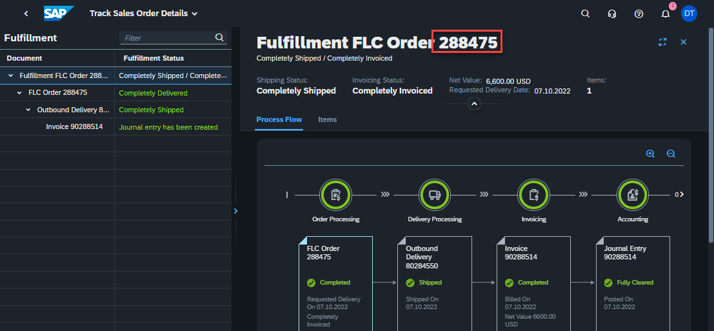
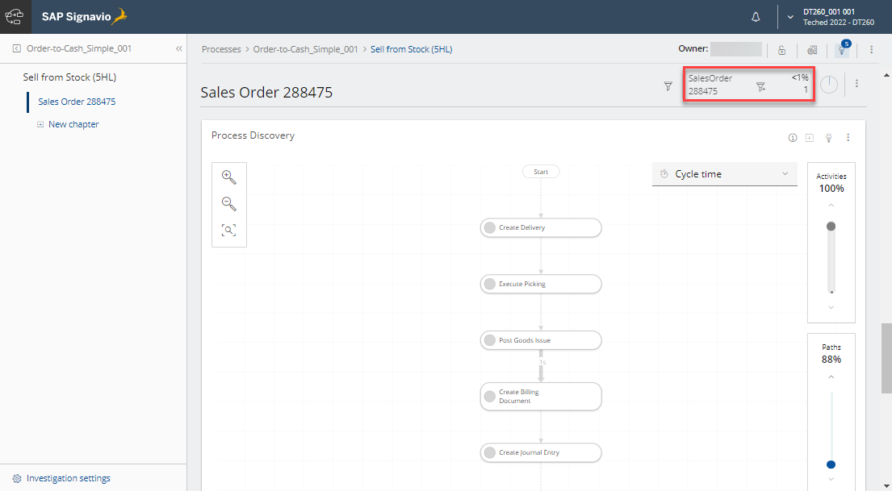
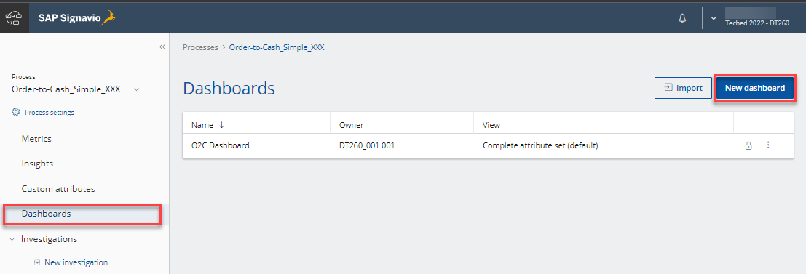
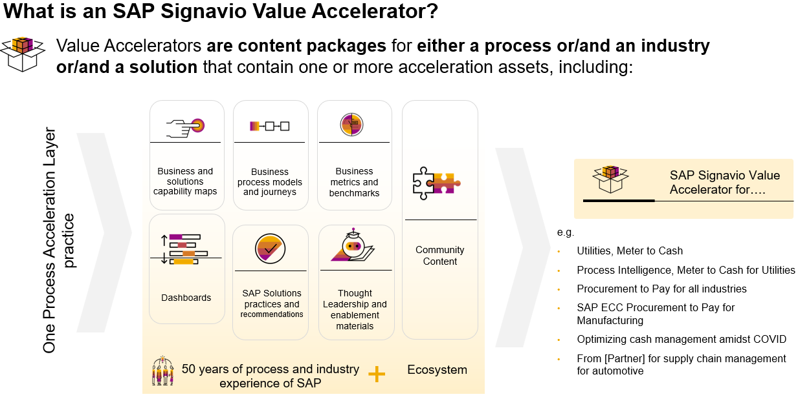

# Bonus Exercises

This chapter contains a couple of ideas to further explore SAP Signavio &amp; SAP S/4HANA Cloud

## Exercise 5.1 Jump into the S/4HANA system
You can access the connected S/4HANA system here: https://my401669.s4hana.cloud.sap/ui
Open app `Track Sales Orders` to find a specific Sales Order to analyze
 
...then in Signavio Process Intelligence create a new Investigation chapter and filter to compare that same Sales Order
 
...add a SiGNAL table widget to show all context data collected in the Process Log

## Exercise 5.2 Dashboards
In Signavio Process Intelligence, you'll find `Dashboards` (next to Investigations). 
 

With a dashboard, you can do in-depth process mining analysis and tell your story using data visualizations. It also lets you monitor key performance indicators that are relevant to a specific goal. You can create many dashboards for each business process, for example, one dashboard for each audience.

On a dashboard, you can also do the following:
* visualize data in widgets, grouping different aspects of complex processes on separate pages
* narrow down data with filters

The layout of a dashboard is flexible. You can resize and rearrange widgets based on your preference.

Multiple users can work simultaneously on a dashboard without overriding each other’s work. So, you can make changes that don't need to be saved, for example, when you change filters for exploration purposes. Only after you save your changes, they become available to other users. If you close the workspace without saving your work, your changes are not preserved.

Users with consumer role can also explore the dashboards shared with them, for example, they can apply individual filters. However, they cannot save their changes.

## Exercise 5.3 SAP Signavio Process Intelligence Accelerators
In this exercise we started based on a simplified data model to analyze the main activities of the Sell from Stock process. SAP Signavio Process Intelligence comes with various detailed pre-built Accelerator templates so that processes can be analyzed in depth. Check them out **[here](https://documentation.signavio.com/suite/en-us/Content/process-intelligence/accelerators-intro.htm)**. Note next to Process Intelligence Accelerators you will further Accelerators in the Signavio ecosystem:
 

## Exercise 5.4 Trigger actions
Watch the following session to get a glimpse on how to trigger follow-up actions, based on findings of your process mining project!

**📺 [Improve, Automate, and Extend Business Processes with Low-Code/No-Code Tools [AD109]](https://go3.events.sap.com/sapteched/hybrid/2022/reg/flow/sap/saptech2022/sapteched2022catalog/page/catalog/session/1661198036877001ERS0)**

Back to the [Overview](../../README.md)
