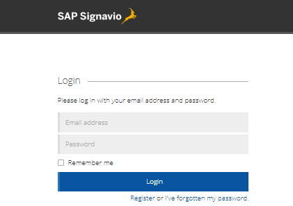
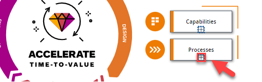
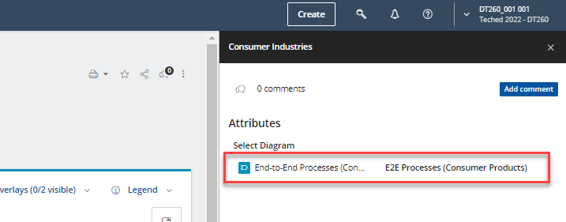
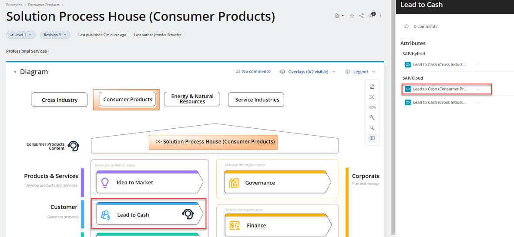
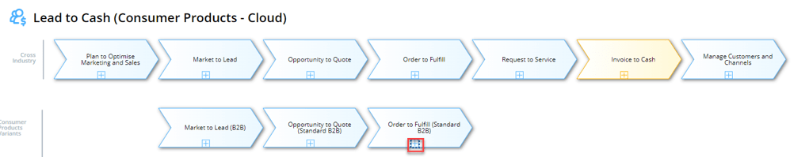
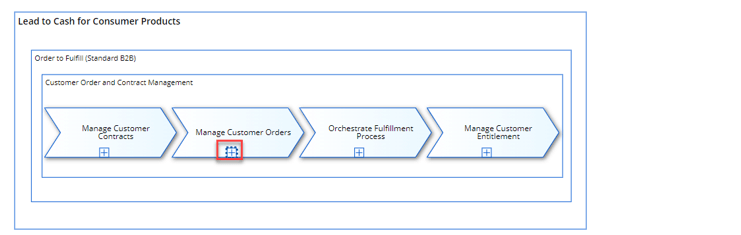
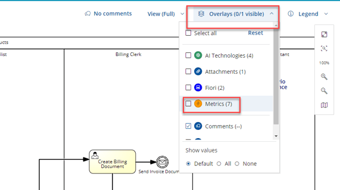
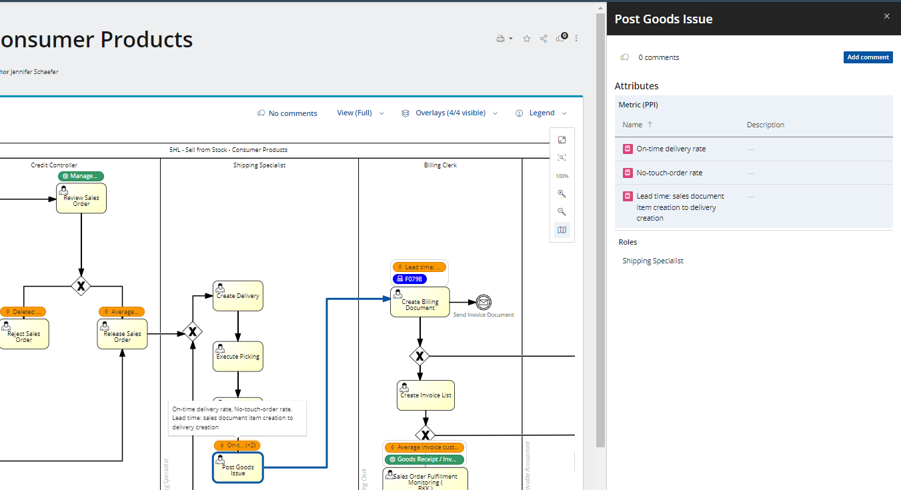

# Exercise 1: Explore Best Practices Processes of SAP S/4HANA Cloud

In this exercise you’ll explore standard processes of an SAP S/4HANA Cloud system. You’ll learn how to find latest product innovations related to the process, learn about typical related KPI metrics.

## Exercise 1.1 Logon

Open the [`SAP Signavio Process Explorer`](https://editor.signavio.com/p/hub)
Logon with your username/password as provided by the trainings 

*Attention:* throughout the exercised replace `XXX` with your personal participant number!

## Exercise 1.2 Navigate SAP Signavio Process Explorer

1. Click on `Solution Processes` to navigate to the Solution Process House for SAP S/4HANA Cloud

2. Click to navigate to the `Solution Process House`

3. At this point you can navigate now directly to the Solution Process House for Consumer Products  (step a.) ) or opening the Solution Process House for Cross Indsutry (step b.) ) content. We will click on the `Solution Process House for Consumer Products`

4. Solution Process House for Consumer Products is open and you can explore the content per end-to-end process. We drill-down further into the process for `Lead-to-Cash` and selecting the `Lead to Cash (Consumer Products)`

5. To navigate to the Sell from Stock we drill down deeper on the `Order to Fulfill (Standard B2B)` process by clicking on the plus sign

6. To see now the BPMN best practice process for Sell from Stock in SAP S/4HANA Cloud, click on the plus sign of `Manage Customer Orders`

7. Overview of the best practice process `5HL - Sell from Stock for Consumer Products`. It provides you with a high level overview of the process flow (in Business Process Modelling Notation), all involved business roles and tasks to fulfill this activity and links to subsequent processes (e.g. J59 Account Receivable)

8. To evaluate the metrics for Sell from Stock, activate the `Overlay` functionality and chose `metrics`.

8. Click one of the orange elements to peek into relevant metrics. 

9. Check out other overlays to find out more about new Fiori apps and Intelligent scenarios.

## Summary

You now learned how to find solution best practices processes of SAP S/4HANA, get an overview of innovations and new Fiori apps. In the next exercise you'll analyze how the process **actually** runs in your SAP S/4HANA Cloud system.

*Note: The content in the Teched exercise tenants was reduced to a subset and  shows a preview version. Today you can already find similar content in the [SAP Best Practices Explorer](https://rapid.sap.com)*

Continue to - [Exercise 2 - Analyse and investigate process mining results](../ex2/README.md)
