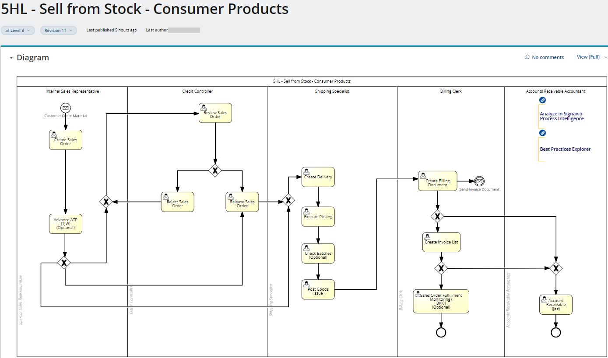
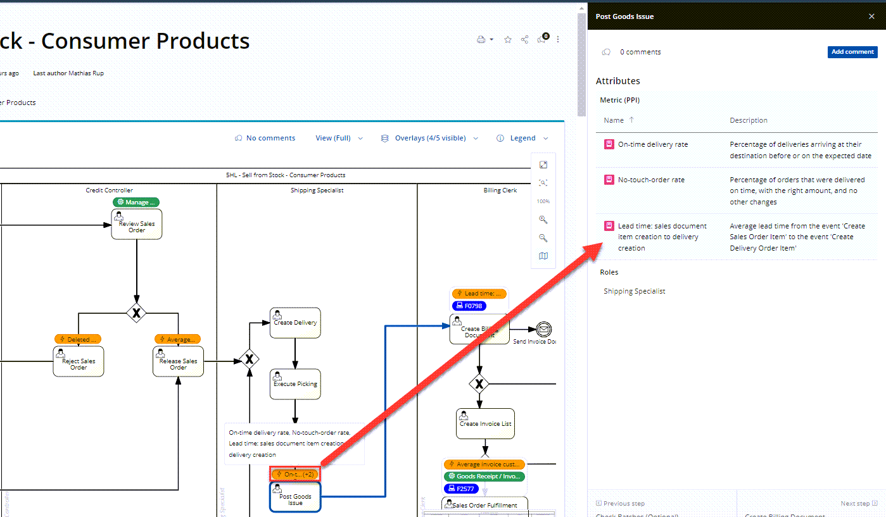

# Exercise 1: Explore best practices processes of SAP S/4HANA Cloud

In this exercise you’ll use SAP Signavio Process Explorer to examine standard processes of an SAP S/4HANA Cloud system. You’ll learn how to find latest product innovations related to the process and learn about typical related KPI metrics. 

## Exercise 1.1 Logon

Open the SAP Signavio Process Explorer [(https://editor.signavio.com/p/hub)](https://editor.signavio.com/p/hub)
Logon with your username/password as provided by the trainings 

_**Attention: throughout the exercise replace `XXX` with your personal participant number!**_

 

## Exercise 1.2 Navigate SAP Signavio Process Explorer

1. Click on the ➕ icon below `Processes` to navigate to the End-to-End Process House: 
 

2. An overview of all End-to-End processes for a cross industry appears. As we are interested in the Consumer Product Industry, we click on `Consumer Industries` 
 

3. In the sidebar (Attribute field), click on `E2E Processes for Consumer Products`
 

4. E2E Process House for Consumer Products is open, and you can explore the content per each end-to-end process. We would like to drill down further into the Lead-to-Cash process. Therefore, we are clicking on the `Lead-to-Cash` button
 

5. And follow the navigation by clicking `Lead to Cash (Consumer Products - Cloud)` within the sidebar
 

6. With another click on the Lead-to-Cash diagram we will land on the overview page of the process: 
 

7. To navigate to the Sell from Stock process, we drill down deeper on the `Order to Fulfill (Standard B2B)` process by clicking on the ➕ sign
 

8. To see now the BPMN (Business Process Modelling Notation)) best practice process for Sell from Stock in SAP S/4HANA Cloud, click on the ➕ sign of `Manage Customer Orders`
 

9. You'll find an overview of the best practice process `5HL - Sell from Stock - Consumer Products` in BPMN diagram, all involved business roles and tasks to fulfill this activity, and links to subsequent processes (e.g. J59 Account Receivable)
 

10. To evaluate the metrics for Sell from Stock, activate the `Overlay` functionality and chose `metrics`.
 

11. Click one of the orange elements to peek into relevant metrics. 
 

12. Check out other overlays to find out more about new Fiori apps and Intelligent scenarios.

## Summary

You now learned how to find solution best practices processes of SAP S/4HANA Cloud, get an overview of innovations and new Fiori apps. In the next exercise you'll analyze how the process **actually** runs in your SAP S/4HANA Cloud system.

*Note: The content in this Teched exercise tenants was reduced to a subset and  shows a preview version only. Today you can already find more in the [SAP Best Practices Explorer](https://rapid.sap.com)*

Continue to - **[Exercise 2 - Analyze and investigate process mining results](../ex2/README.md)**

Back to the [Overview](../../README.md)
