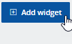
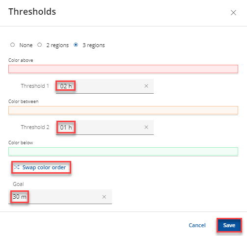
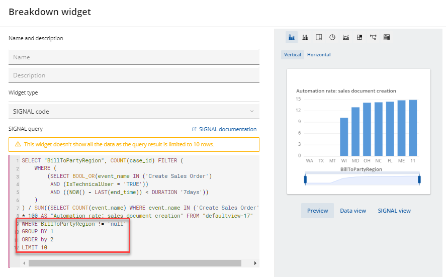

# Exercise 2: Analyse and investigate process mining results

In the previous exercise we saw how the process `Sell from Stock - Consumer Products (5HL)` is designed in SAP S/4HANA Cloud. In this exercise you’ll jump into SAP Signavio Process Intelligence to retrieve live insights how processes are executed **actually** in your SAP S/4HANA Cloud system. 

## Exercise 2.1 Jump to SAP Signavio Process Intelligence

SAP Signavio Process Intelligence is a collaborative process mining solution that helps you unleash the power in your process and experience data to transform your business.

1. In the diagram (previous exercise) click the hyperlink `Analyze in Signavio Process Intelligence` as shown below. (Alternatively you can open Process Intelligence [here](https://editor.signavio.com/g/statics/pi/areas))
 

2.	Open your process investigation (instead of `XXX` select your personal group number)
 

3. Open `Sell from Stock (5HL)` to start an investigation
 

## Exercise 2.2 Conformance
The first widget will give an overview about process conformance. 
The BPMN model of our best practices process (Sell from Stock - 5HL) was linked as a base process. The paths respectively hotspots are displayed as overlays (blue color). Explore some of the different process variants with the panel on the right.
 

## Exercise 2.3 Measure one of the pre-defined metrics

1. Scroll down to the end of the screen and click `Add Widget`
 

2. Select `Value`
 

3. Select type `Metric` and select `Lead time: sales document item creation to delivery creation` (you might remember that metric from Exercise 1). Click `Save` to confirm.
 
 The new metric is added to the investigation.

4. Click the 3-dots to add a `Threshold`
 

5. Select `3 regions` and put thresholds like shown below
 

6. The thresholds are shown below the actual measurement
 

*Note: Further metrics of Lead-to-Cash can be found within the metric library. In the sidebar select `Metrics` and click `Add new metric` and select `From metric library`. Majority have not been configured due to the simplified data model of this exercise but will be applicable when you start with the full scale Order-to-Cash data model.*

## Exercise 2.4 Automated insights
The various Widgets available in Signavio Process Intelligence allow to flexibly drill down into data of the actual productive backend system. In this exercise we'll make use of the machine learning supported `Automated Insights` feature to __autonomously__ find correlations/anomalies.

1. Click the light bulb icon top right of the investigation screen.
 

2. Select `Automated` and select one of the suggested insights to click `Add to investigation`. In this Exercise choose `Automation rate...BillToPartyRegion...` (*Press Ctrl+F to find on screen*) and confirm by clicking `Paste here`
 

3. The widget is added at the end of the investigation. Scroll down to click the 3-dots to `Edit` the widget.
 

4. You can find the SiGNAL query that was generated and change e.g. the `Order`, LIMIT and add a `WHERE` condition to filter values without a BillToRegion. 
 

*Note: This exercise uses a machine generated dataset so also Automated Insights will only unfortunately only be able to return very artificial results.*

## Summary

Yay! 🥳 You've now started your first basic investigation based on a simplified data model for this exercise. Typically you'd start with one of the [SAP Signavio Process Intelligence Accelerators](https://documentation.signavio.com/suite/en-us/Content/process-intelligence/accelerators-intro.htm) which are pre-built set of data pipelines, metrics and dashboards. They are designed to help you speed up your business process transformation. They simplify event log creation and reduce the time to insight.

Continue to - **[Exercise 3: Adapt the process data pipeline](../ex3/README.md)**

Back to the [Overview](../../README.md)
