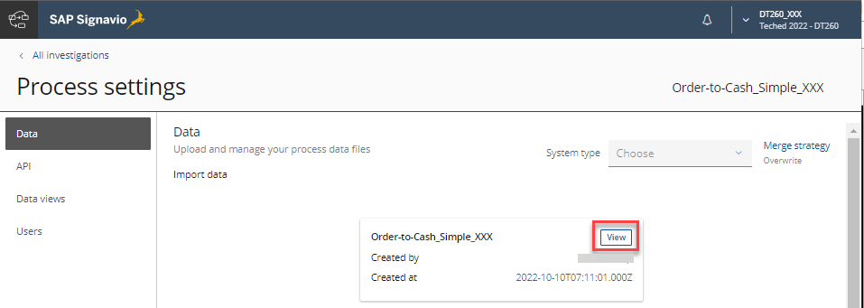
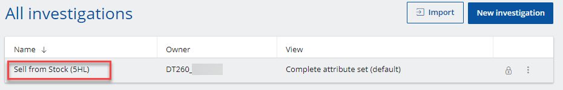
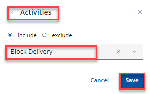

# Exercise 3: Adapt the process data model

In the previous exercise we analysed standard activities related to the 'Sell from Stock' process. In this exercise we'll further extend the process data model, adding another Business Event and context data out of the connected SAP S/4HANA Cloud system.


## Exercise 3.1 Navigate to the process data model

1. Click `Process settings`
<br>

2. Under tab `Data` click `View`
<br>

This will lead you to the underlying process data model. 

Process data management involves a wide range of tasks, such as extracting, transforming, and loading data. A process data pipeline is used to carry out these tasks. The process data pipeline regularly extracts data from a source system, transforms it, and loads it into a process. So, process analysts can always investigate latest representations of a process.


## Exercise 3.2 Add further Events

1. Click `Sales Order` in the process data pipeline step to open the Event collector
<br>

2. Click `Add event collector`
<br>

3. Copy & paste the following code into the new collector. You might also rename it to `Block delivery`
```sql
SELECT
    'Block delivery' as c_eventname,
    replace(ltrim(replace(SAPBusinessObjectNodeKey1, '0', ' ')), ' ', '0') AS c_caseid,
    FROM_UNIXTIME(BusEvtLogCreationDateTime / 1000) AS c_time, 
    CreatedByUser,
    IsTechnicalUser
FROM 
   C_BusEvtLogEventDEX AS e
   LEFT JOIN  C_BusEvtLogPayloadDEX as p ON e.businesseventuuid = p.businesseventuuid
WHERE 
   e.SAPObjectType = 'SalesOrder' AND
   e.SAPObjectNodeType != 'SalesOrderItem' AND
   e.BusinessEventType = 'OvrlDlvBlkStsChgd' AND
   p.BusEvtLogNewFieldValue IN ('C') -- C=blocked
```
The SQL-based transformation will add the new event to our process log (*Cases*; each case equals to a single Sales Order).

4. Click the `preview` button to check if the extractor returns entries
<br>

5. Confirm by clicking the `Save` button
<br>

6. Note, to find further events open [api.sap.com](https://api.sap.com) in a new browser window, navigate to `S/4HANA Cloud` -> `Events`. Search for business object `Sales Order`, find the event `Overall Delivery Block Status Changed`
<br>

7. Further details can be found in `Event reference` as well as in the `Business Documentation`. Follow the links to learn more about the underlying process details. E.g. click  `Event reference` and search for `OvrlDlvBlkStsChgd` to learn more about the event that we just added to our data model before.
<br>


## Exercise 3.3 Add further case attributes

1. Select `Case attributes` (1) and search for column `DistributionChannel` (2), Click column `DistributionChannel` to add it to the case attributes in the SQL editor (you might need to move it to the proper location) and don't forget to seperate column names with a comma (4)
<br>

2. Click the `preview` button to check if the new column was added correctly
<br>

3. Confirm by clicking the `Save` button
<br>

4. Note, to learn more about the S/4HANA virtual data model go to [api.sap.com](https://api.sap.com) in a new browser window, navigate to `S/4HANA Cloud` -> `CDS Views`. E.g. search for CDS View `I_SalesOrder` and find the field `DistributionChannel`
<br>

5. Navigate back to the pipeline overview by clicking `Order-to-Cash_Simple_XXX`
<br>


## Exercise 3.4 Retrieve the latest data out of the productive S/4HANA Cloud system

1. In the pipeline overview, click `Run T&L` to run the transform & load step. 
<br>
 *⚠️ Note: Clicking the ETL button would also retrieve the latest delta out of the actual S/4HANA Cloud backend system. During the exercise all participants are connected to the very same system and clicking ETL is to be avoided as it leads to additional delays* 

2. Find the pipeline logs below the pipeline overview and click the latest entry to see the progress of the transform and load steps. 
<br>

3. Wait until both indicators show a green status
<br>

Note: in case of errors click the log entry to find further details about the error. You might need to fix/adjust your extraction scripts and re-run T&L.

<br>You can fetch a quick cup of 🍵 or browse the systems... the transformation step will take ~5-10 minutes to complete.

4. Click the box as shown below to *navigate back* into the investigation view. 
<br>

5. Select the investigation to open it
<br>

6. Let us analyze the blocked orders. In your investigation click  `New Chapter`
<br>

7. Name the chapter `Blocked Deliveries` and confirm by clicking the checkmark
<br>

8. Create a new Widget type of `Value`
<br>

9. Select `Case` as attribute; this will first give us the total number of Sales Orders, we'll take care of that in the next step. Click `Save` to close.
<br>

10. To now only select the *blocked* Sales Orders we can add a Filter
<br>

11. Select `Activities` then as Event we'll use our newly created Event `Block Delivery`
<br>
💡 In case you do not see the Activity `Block Delivery` go back to your Process Data Pipeline and ensure that the `Transform & Load` was run successfully

12. Last we'll also add a new Widget type of `Case Table`
<br>

13. And simply select all fields. Ensure to also add a Filter to only select `Block Delivery`activities.
<br>

14. Your result can look something like this
<br>

💡 The case table now lists Sales Orders where the Delivery has been blocked during the process. The Case ID refers to the Sales Order number out of the SAP S/4HANA system. As you learned you can flexibly structure your Investigations in Chapters. Filters can be applied on various levels like Investigation, Chapter or Widget.


## Summary

Congrats! 🥳 You've now added further events and attributes to the process data model. You can now work with the additional context in your investigation, and also find further Automated Insights! 

Continue to - **[Exercise 4: Investigate and improve your process](../ex4/README.md)**

Back to the [Overview](../../README.md)

