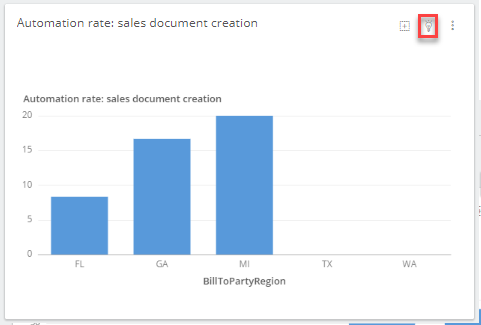

# Exercise 4: Investigate and improve your process

In this exercise we'll learn how we can use SAP Signavio Process Intelligence drill into process details. We'll mark spots for improvement with the built in Insights to collaboratively track process improvements. Then we'll check how to use the Process Explorer again to find potential innovations helping implement process improvements.

## Exercise 4.1 Add a new behaviour based-investigation
We suspect that there is some rework happening due to the fact that a Sales Order was not created properly in first place. So well try to further dissect the data set. 

1. To test our hypothesis we'll create a `New Chapter`
 

2. Name it `Automation Rate`
 

3. Add a new filter (on chapter level) based on `Behavior`
 

4. We first check that the `Create Sales Order` was initiating the process
 

5. And add a second `Behavior` filter that filters processes with rework
 

6. Add a `Breakdown` widget
 

7. And select type `metric` and select `Automation rate: Sales document creation`. Group by `BillToPartyCountry`
 

## Exercise 4.2 Mark a process insight and share with a colleague

1. We see that Colombia seems to have a reduced automation rate, compared to Canada and US. Click the `light bulb` to add an insight
 

2. Log a new insight, assign a Value Driver and select `Jennifer` as Assignee
 

With this we've given our colleague Jennifer a task to further investigate. We'll proceed in the next exercise to investigate options. 

## Exercise 4.3 Check SAP Signavio Process Explorer for recommendations

1. Go back to the Process Collaboration Hub and navigate to process `Sell from Stock (5HL)`(or click [here](https://editor.signavio.com/p/hub/model/7148c645c5b3433f9a3482c81372a00b)). Ensure that the overlay `AI Technologies` is active.
 

2. Find the `Create Sales Order` activity and find one an available automation `5LT Automatic Creation of Sales Order from Unstructured Data`. 
 

3. Click the link to follow to find further information about the available automation
 

You can now contact the colleagues in *Columbia* and check if they would benefit from automating their Sales Order creation process! As soon as they've activated the capability you can see improvements in a trend analysis in SAP Signavio Process Intelligence.

## Summary

You made it! 🥳 You've now learned to deep dive into process analytics. Learned how the SAP Signavio Process Explorer offers a comprehensive overview on next generation practices, where processes can be enhanced using Machine Learning, Automation, or simply by leveraging modern Fiori Apps!

Now head over to - **DT262 to learn more on how to automate SAP S/4HANA with SAP Build Process Automation!**
